# Agrythm Connect (prototype)

Voice-first farmer relationship and execution layer. This repo is the zero-cost prototype, built TRL by TRL (see `docs/TRL_PLAN.md`).

## Project status

<p align="center">
  
</p>

**Current TRL 1 (Basic research)** as reported. Early prototype code already exists ahead of formal level sign-off: a text-only loop on mock data with 99 automated tests passing, no external services and standard library only (pytest for tests). Nothing has been tested with real farmers or real phone calls yet.

To update the animation after moving to a new level, change `REPORTED_TRL` in `connect/models.py`, update the text and table above, and run `python scripts/make_trl_ladder.py`. A test fails if the picture is out of date.

## Quick start
```
pip install -r requirements.txt
python -m pytest -q
python -m connect.cli --list
python -m connect.cli --farmer 1
```

## Flow
`create_event` (Gate 1) → `build_context` (Gate 2) → `ConversationSession` (understand → policy gate → reply) → structured outcome in `conversations` (Gate 4).

## Safety
All agent replies pass `connect/policy.py`: any molecule, dose, compatibility claim or harvest-interval that is not in the approved advisory/facts is blocked and the case escalates to a human.

## Demo data
`connect/seed.py` creates 5 fake farmers. Advisory text is placeholder content, not agronomic guidance.
